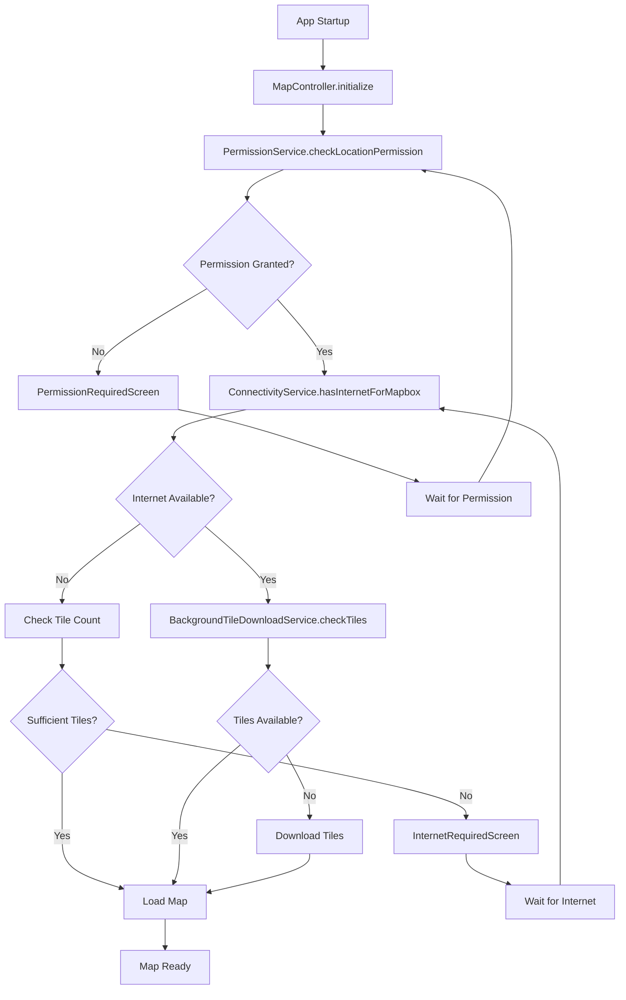

# Map Loading, Internet & Permissions Logic Documentation

## 📋 Table of Contents
1. [Overview](#overview)
2. [Map Initialization State Machine](#map-initialization-state-machine)
3. [Permission Management](#permission-management)
4. [Internet Connectivity Logic](#internet-connectivity-logic)
5. [Offline Mode & Tile Management](#offline-mode--tile-management)
6. [Use Cases & Scenarios](#use-cases--scenarios)
7. [UI Components](#ui-components)
8. [Service Architecture](#service-architecture)

## 🎯 Overview

The SpaceTime app implements a sophisticated map loading system that handles:
- **Location permissions** (request, check, monitor)
- **Internet connectivity** (detection, verification, fallback)
- **Offline tile management** (download, storage, quota)
- **State-driven UI** (loading screens, error handling, recovery)

The system uses a state machine approach with reactive UI components that respond to permission and connectivity changes in real-time.

## 🔄 Map Initialization State Machine

### States
```dart
enum MapInitializationState {
  initial,           // Starting state
  checkingPermission, // Checking location permission
  permissionDenied,   // Permission denied by user
  checkingInternet,   // Checking internet connectivity
  internetRequired,   // No internet + insufficient tiles
  downloadingTiles,   // Downloading offline tiles
  loadingMap,        // Loading Mapbox map
  ready,             // Map ready for use
  error              // Error state
}
```

### State Transitions

#### 1. **Initial → Checking Permission**
- **Trigger**: App startup or map refresh
- **Logic**: Automatically advances to permission check
- **Code Location**: `MapController._advanceState()`

#### 2. **Checking Permission → Permission Denied/Checking Internet**
- **Trigger**: Permission check result
- **Logic**: 
  ```dart
  final permissionService = Get.find<PermissionService>();
  if (permissionService.hasLocationPermission.value) {
    _setState(MapInitializationState.checkingInternet);
  } else {
    _setState(MapInitializationState.permissionDenied);
  }
  ```
- **Code Location**: `MapController._advanceState()`

#### 3. **Checking Internet → Internet Required/Loading Map/Downloading Tiles**
- **Trigger**: Internet connectivity check
- **Logic**:
  ```dart
  final hasInternetForMapbox = await connectivityService.hasInternetForMapbox();
  
  if (hasInternetForMapbox) {
    final hasOfflineTiles = await isOfflineDataAvailable();
    if (hasOfflineTiles) {
      _setState(MapInitializationState.loadingMap);
    } else {
      _setState(MapInitializationState.downloadingTiles);
    }
  } else {
    await _checkOfflineTilesAndSetState();
  }
  ```

#### 4. **Internet Required → Loading Map**
- **Trigger**: Internet connectivity restored
- **Logic**: Automatic detection via connectivity listener
- **Code Location**: `InternetRequiredScreen._setupConnectivityListener()`

#### 5. **Downloading Tiles → Loading Map**
- **Trigger**: Sufficient tiles downloaded
- **Logic**: Background service monitors tile count
- **Code Location**: `BackgroundTileDownloadService`

#### 6. **Loading Map → Ready/Error**
- **Trigger**: Mapbox map initialization result
- **Logic**: Success/failure of map creation
- **Code Location**: `MapController.onMapCreated()`

## 🔐 Permission Management

### Permission Service (`PermissionService`)

#### Core Functionality
- **Real-time monitoring** of location permission status
- **Automatic permission requests** with user-friendly dialogs
- **Service availability checks** (GPS enabled/disabled)
- **Stream-based notifications** for permission changes

#### Permission States
```dart
final RxBool hasLocationPermission = false.obs;
final RxBool isLocationServiceEnabled = false.obs;
final RxBool isCheckingPermissions = false.obs;
final RxBool permissionJustGranted = false.obs;
```

#### Use Cases

##### 1. **Initial Permission Check**
- **When**: App startup, map initialization
- **Logic**: 
  ```dart
  Future<bool> checkLocationPermission({bool requestIfDenied = false}) async {
    // Check if location service is enabled
    bool serviceEnabled = await Geolocator.isLocationServiceEnabled();
    
    if (!serviceEnabled) {
      if (requestIfDenied) await _showLocationServiceDialog();
      return false;
    }
    
    // Check permission status
    LocationPermission permission = await Geolocator.checkPermission();
    
    if (permission == LocationPermission.denied && requestIfDenied) {
      permission = await Geolocator.requestPermission();
    }
    
    return _isPermissionGranted(permission);
  }
  ```

##### 2. **Permission Request Flow**
- **When**: User taps "Grant Permission" button
- **UI**: Shows loading dialog during request
- **Logic**: 
  ```dart
  final granted = await permissionService.requestLocationPermission();
  if (!granted) {
    // Show error snackbar
    Get.snackbar('Permission Denied', 'Location permission is required...');
  }
  ```

##### 3. **Permission Denied Forever**
- **When**: User permanently denies permission
- **UI**: Shows dialog with "Open Settings" option
- **Logic**: 
  ```dart
  if (permission == LocationPermission.deniedForever) {
    await _showPermissionDeniedDialog(); // Opens app settings
    return false;
  }
  ```

##### 4. **Location Service Disabled**
- **When**: GPS/Location services are turned off
- **UI**: Shows dialog with "Open Location Settings" option
- **Logic**: 
  ```dart
  if (!serviceEnabled) {
    await _showLocationServiceDialog(); // Opens location settings
    return false;
  }
  ```

### Permission UI Components

#### Permission Required Screen (`PermissionRequiredScreen`)
- **Purpose**: Full-screen overlay when permission is denied
- **Features**:
  - Real-time permission status display
  - Modern card-based UI with status indicators
  - "Grant Permission" button with loading states
  - Automatic dismissal when permission granted

## 🌐 Internet Connectivity Logic

### Connectivity Service (`ConnectivityService`)

#### Internet Check Methods

##### 1. **Basic Connectivity Check**
```dart
Future<void> _checkConnectivity() async {
  final results = await _connectivity.checkConnectivity();
  _handleConnectivityChange(results);
}
```

##### 2. **Internet Verification**
```dart
Future<void> _verifyInternetConnectivity() async {
  final result = await InternetAddress.lookup('google.com')
      .timeout(const Duration(seconds: 5));
  final hasInternet = result.isNotEmpty && result[0].rawAddress.isNotEmpty;
}
```

##### 3. **Mapbox-Specific Check**
```dart
Future<bool> hasInternetForMapbox() async {
  final connectivityResult = await _connectivity.checkConnectivity();
  if (connectivityResult == ConnectivityResult.none) return false;
  
  final response = await http.get(Uri.parse('google.com'))
      .timeout(const Duration(seconds: 3));
  return response.statusCode == 200;
}
```

##### 4. **Quick Check**
```dart
Future<bool> hasInternetQuickCheck() async {
  final result = await InternetAddress.lookup('google.com')
      .timeout(const Duration(milliseconds: 800));
  return result.isNotEmpty && result[0].rawAddress.isNotEmpty;
}
```

### Internet Required Conditions

#### When Internet Required Screen Shows:

##### 1. **No Internet + Insufficient Tiles**
```dart
if (!hasInternetForMapbox) {
  final tileCount = backgroundService.totalTilesDownloaded.value;
  final hasSufficientTiles = tileCount >= 25000; // Main map threshold
  
  if (!hasSufficientTiles) {
    _setState(MapInitializationState.internetRequired);
  }
}
```

##### 2. **First Time Load Without Internet**
```dart
if (isFirstTimeLoad.value && !hasInternet && !hasOfflineTiles.value) {
  shouldShowInternetScreen.value = true;
  needsInternetConnection.value = true;
}
```

##### 3. **Mapbox Connection Error**
```dart
if (connectivityService.isMapboxConnectivityError(error.toString())) {
  _setState(MapInitializationState.internetRequired);
}
```

## 🗺️ Offline Mode & Tile Management

### Background Tile Download Service (`BackgroundTileDownloadService`)

#### Tile Quotas & Thresholds
- **Warning Threshold**: 40,000 tiles
- **Maximum Limit**: 50,000 tiles
- **Main Map Minimum**: 25,000 tiles
- **Location Picker Minimum**: 30,000 tiles

#### Download States
```dart
final RxBool isDownloading = false.obs;
final RxBool stopDownloading = false.obs;
final RxBool autoDownloadEnabled = true.obs;
final RxBool forceOfflineMode = false.obs;
final RxInt totalTilesDownloaded = 0.obs;
```

#### Quota Management Logic
```dart
void _checkQuotaAndManageDownloads() {
  final currentTiles = totalTilesDownloaded.value;
  
  if (currentTiles >= maxTilesLimit.value) {
    _enforceOfflineMode(); // Stop all downloads
  } else if (currentTiles >= warningThreshold.value) {
    _enableOfflineModeOnly(); // Enable offline but continue downloads
  }
}
```

### Offline Data Availability Check
```dart
Future<bool> isOfflineDataAvailable() async {
  if (tileStore == null || offlineManager == null) return false;

  final backgroundService = Get.find<BackgroundTileDownloadService>();
  final tileCount = backgroundService.totalTilesDownloaded.value;
  return tileCount > 0;
}
```

## 📱 Use Cases & Scenarios

### Scenario 1: First App Launch (No Permissions, No Internet)
**Flow**:
1. `initial` → `checkingPermission` → `permissionDenied`
2. User sees **Permission Required Screen**
3. User taps "Grant Permission" → Permission dialog appears
4. If granted: `permissionDenied` → `checkingInternet` → `internetRequired`
5. User sees **Internet Required Screen**
6. When internet available: `internetRequired` → `downloadingTiles` → `loadingMap` → `ready`

**Key Components**:
- `PermissionRequiredScreen`: Full-screen permission request
- `InternetRequiredScreen`: Internet connection prompt
- `TileDownloadBanner`: Shows download progress

### Scenario 2: App Launch with Permissions but No Internet
**Flow**:
1. `initial` → `checkingPermission` → `checkingInternet` → `internetRequired`
2. User sees **Internet Required Screen** with tile count info
3. If sufficient tiles (≥25,000): Automatically proceeds to `loadingMap`
4. If insufficient tiles: Waits for internet connection

**Logic**:
```dart
if (!hasInternetForMapbox) {
  final tileCount = backgroundService.totalTilesDownloaded.value;
  final hasSufficientTiles = tileCount >= 25000;

  if (!hasSufficientTiles) {
    _setState(MapInitializationState.internetRequired);
  } else {
    _setState(MapInitializationState.loadingMap);
  }
}
```

### Scenario 3: Internet Connection Lost During Use
**Flow**:
1. App running in `ready` state
2. Internet connection lost
3. Connectivity service detects change
4. If sufficient tiles: Continue normal operation
5. If insufficient tiles: Show **Internet Required Screen**

**Auto-Recovery**:
```dart
// In InternetRequiredScreen
_setupConnectivityListener() {
  connectivityService.isConnected.listen((isConnected) async {
    if (isConnected) {
      final hasInternet = await connectivityService.hasInternetForMapbox();
      if (hasInternet) {
        mapController.setState(MapInitializationState.loadingMap);
        mapController.refreshMapView();
      }
    }
  });
}
```

### Scenario 4: Location Picker with Insufficient Tiles
**Flow**:
1. User opens location picker
2. Check internet and tiles: `_checkInternetAndTiles()`
3. If internet available and tiles < 30,000: Proceed normally
4. If no internet and tiles < 30,000: Show **Internet Required Location Picker Screen**

**Threshold Logic**:
```dart
final tileCount = backgroundService.totalTilesDownloaded.value;
if (hasInternet && tileCount < 30000) {
  _setCurrentState(LocationPickerState.ready);
} else {
  await _checkTileCountAndSetState();
}
```

### Scenario 5: Permission Revoked During Use
**Flow**:
1. App running normally
2. User revokes location permission in system settings
3. Permission service detects change via monitoring
4. Map state changes to `permissionDenied`
5. **Permission Required Screen** appears

**Monitoring Logic**:
```dart
void _initializePermissionMonitoring() {
  Timer.periodic(const Duration(seconds: 2), (timer) {
    _checkPermissionStatus();
  });
}
```

### Scenario 6: Tile Quota Reached
**Flow**:
1. Background downloads reach 50,000 tiles
2. `_enforceOfflineMode()` called
3. All downloads stopped
4. Offline mode permanently enabled
5. User notification shown

**Enforcement Logic**:
```dart
void _enforceOfflineMode() {
  forceOfflineMode.value = true;
  stopDownloading.value = true;
  _stopAllDownloads();

  Get.snackbar(
    'Offline Mode Activated',
    'Maximum tiles downloaded (${totalTilesDownloaded.value}). App now running in offline mode.',
    backgroundColor: Colors.blue,
    duration: Duration(seconds: 5),
  );
}
```

## 🎨 UI Components

### 1. Permission Required Screen
**File**: `lib/app/modules/map/views/mini_widgets/permission_required_screen.dart`

**Features**:
- Blurred backdrop overlay
- Modern card design with gradients
- Real-time permission status display
- Animated state transitions
- "Grant Permission" button with loading states

**Key UI Elements**:
```dart
// Permission status indicator
Container(
  decoration: BoxDecoration(
    gradient: LinearGradient(
      colors: permissionService.hasLocationPermission.value
          ? [Colors.green.withOpacity(0.1), Colors.green.withOpacity(0.05)]
          : [Colors.orange.withOpacity(0.1), Colors.orange.withOpacity(0.05)],
    ),
  ),
  child: // Status content
)
```

### 2. Internet Required Screen
**File**: `lib/app/modules/map/views/mini_widgets/internet_required_screen.dart`

**Features**:
- Automatic connectivity detection
- Real-time tile count display
- Multiple internet check methods
- Connection options dialog
- Auto-dismissal when internet restored

**Auto-Recovery Logic**:
```dart
_setupConnectivityListener() {
  connectivityService.isConnected.listen((isConnected) async {
    if (isConnected) {
      final hasInternet = await connectivityService.hasInternetForMapbox();
      if (hasInternet) {
        mapController.setState(MapInitializationState.loadingMap);
        mapController.refreshMapView();
      }
    }
  });
}
```

### 3. Internet Required Location Picker Screen
**File**: `lib/app/modules/memories/views/mini_widgets/internet_required_location_picker_screen.dart`

**Features**:
- Location picker specific thresholds (30,000 tiles)
- Retry callback functionality
- Tile count progress display
- Periodic status refresh

### 4. Tile Download Banner
**File**: `lib/app/modules/map/views/mini_widgets/tile_download_banner.dart`

**Features**:
- Real-time download progress
- Color-coded status (downloading/warning/complete)
- Tile count with formatted numbers
- Auto-hide when not downloading

**Status Colors**:
```dart
Color _getBannerColor(bool isDownloading, TileQuotaStatus quotaStatus, UiController uiController, bool isComplete) {
  if (isComplete) return Colors.green;           // 50K tiles reached
  if (isDownloading) return uiController.currentMainColor; // Active download
  return Colors.blue.shade600;                   // Ready but not complete
}
```

## 🏗️ Service Architecture

### Core Services

#### 1. MapController
**File**: `lib/app/modules/map/controllers/map_controller.dart`
**Responsibilities**:
- State machine management
- Map initialization coordination
- Error handling and recovery
- Offline data management

**Key Methods**:
- `startMapInitializationSequence()`: Main entry point
- `_advanceState()`: State machine progression
- `_checkInternetAndAdvance()`: Internet validation
- `isOfflineDataAvailable()`: Tile availability check
- `refreshMapView()`: Map reload after recovery

#### 2. PermissionService
**File**: `lib/services/permission_service.dart`
**Responsibilities**:
- Location permission management
- Real-time permission monitoring
- User dialog handling
- Permission state broadcasting

**Key Observables**:
```dart
final RxBool hasLocationPermission = false.obs;
final RxBool isLocationServiceEnabled = false.obs;
final RxBool isCheckingPermissions = false.obs;
final RxBool permissionJustGranted = false.obs;
```

#### 3. ConnectivityService
**File**: `lib/services/connectivity_service.dart`
**Responsibilities**:
- Network connectivity monitoring
- Internet verification (multiple methods)
- Mapbox-specific connectivity checks
- Connection state broadcasting

**Key Methods**:
- `hasInternetForMapbox()`: Enhanced check for map services
- `hasInternetQuickCheck()`: Fast connectivity verification
- `hasInternetForMaps()`: General map connectivity check
- `isMapboxConnectivityError()`: Error classification

#### 4. BackgroundTileDownloadService
**File**: `lib/services/background_tile_download_service.dart`
**Responsibilities**:
- Automatic tile downloading
- Quota management and enforcement
- Download progress tracking
- Offline mode activation

**Key Features**:
- Isolate-based downloading for performance
- Configurable quotas and thresholds
- WiFi-only download option
- Automatic quota enforcement

#### 5. GlobalTileManager
**File**: `lib/services/global_tile_manager.dart`
**Responsibilities**:
- Cross-module tile management
- Cache path coordination
- Regional tile downloads
- World base tile management

### Service Integration Flow



## 🔧 Configuration & Settings

### Tile Download Configuration
```dart
// Quota limits
static const int DEFAULT_MAX_TILES = 50000;
static const int DEFAULT_WARNING_THRESHOLD = 40000;

// Download intervals
static const Duration DOWNLOAD_INTERVAL = Duration(seconds: 30);
static const Duration QUOTA_CHECK_INTERVAL = Duration(minutes: 1);

// Thresholds for different components
static const int MAIN_MAP_MIN_TILES = 25000;
static const int LOCATION_PICKER_MIN_TILES = 30000;
```

### Permission Check Intervals
```dart
// Permission monitoring frequency
static const Duration PERMISSION_CHECK_INTERVAL = Duration(seconds: 2);

// Internet connectivity check timeouts
static const Duration MAPBOX_CHECK_TIMEOUT = Duration(seconds: 3);
static const Duration QUICK_CHECK_TIMEOUT = Duration(milliseconds: 800);
```

## 🚨 Error Handling & Recovery

### Error Types & Responses

#### 1. **Permission Errors**
- **LocationPermission.denied**: Show request dialog
- **LocationPermission.deniedForever**: Show settings dialog
- **Service disabled**: Show location settings dialog

#### 2. **Connectivity Errors**
- **No network**: Show internet required screen
- **Mapbox API errors**: Retry with fallback checks
- **Timeout errors**: Use quick check as fallback

#### 3. **Map Loading Errors**
- **Mapbox initialization failure**: Check connectivity and retry
- **Tile loading errors**: Fall back to offline tiles
- **Style loading errors**: Retry with default style

### Recovery Mechanisms

#### Automatic Recovery
```dart
// Internet restoration
connectivityService.isConnected.listen((isConnected) async {
  if (isConnected) {
    final hasInternet = await connectivityService.hasInternetForMapbox();
    if (hasInternet) {
      mapController.setState(MapInitializationState.loadingMap);
      mapController.refreshMapView();
    }
  }
});

// Permission restoration
permissionService.permissionChanges.listen((hasPermission) {
  if (hasPermission) {
    mapController._advanceToNextState();
  }
});
```

#### Manual Recovery
- **Retry buttons**: In internet required screens
- **Settings shortcuts**: Direct links to system settings
- **Refresh actions**: Manual map reload triggers

## 📊 Monitoring & Debugging

### Debug Logging
The system includes comprehensive debug logging with prefixed messages:
- `🔐` Permission-related logs
- `🌐` Internet connectivity logs
- `🗺️` Map loading logs
- `📱` Tile download logs
- `❌` Error logs
- `✅` Success logs

### Key Debug Points
```dart
// Permission checks
debugPrint('🔐 Location permission granted: $granted');

// Internet verification
debugPrint('🌐 Internet access confirmed via HTTP ping');

// State transitions
debugPrint('🗺️ State transition: $oldState → $newState');

// Tile management
debugPrint('📱 Tile count: $tileCount, threshold: $threshold');
```

### Performance Monitoring
- **State transition timing**: Track initialization duration
- **Internet check performance**: Monitor check response times
- **Tile download progress**: Track download rates and completion
- **Memory usage**: Monitor tile cache size and cleanup

---

## 📝 Summary

This documentation covers the complete map loading, internet connectivity, and permissions system in the SpaceTime app. The architecture provides:

- **Robust state management** with clear transitions and error handling
- **Real-time monitoring** of permissions and connectivity
- **Intelligent offline support** with automatic tile management
- **User-friendly UI** with clear status indicators and recovery options
- **Comprehensive error handling** with automatic and manual recovery mechanisms

The system is designed to provide a seamless user experience while handling the complexities of mobile connectivity, permissions, and offline functionality.
